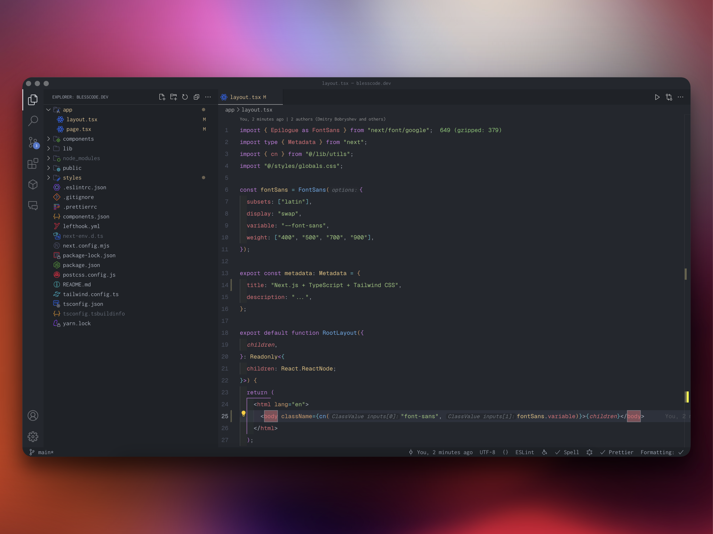
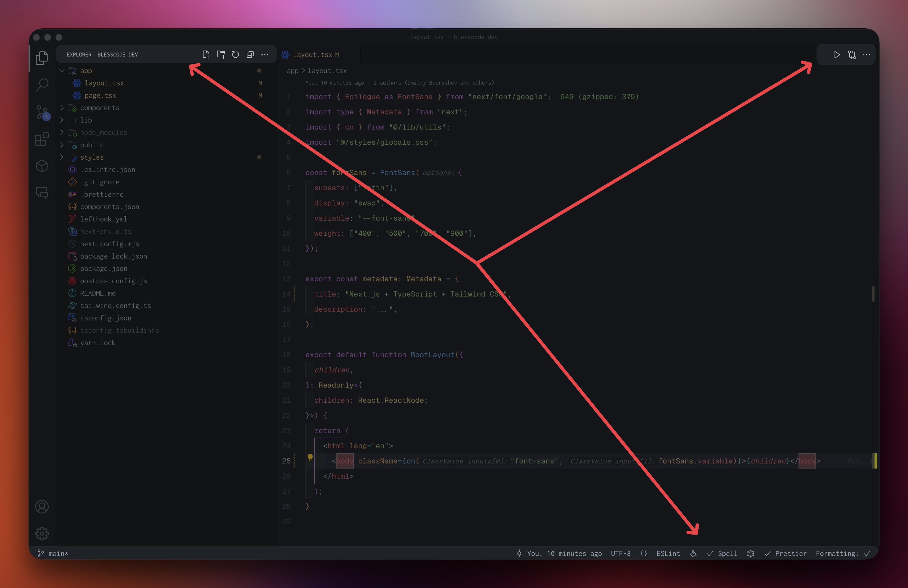

# 🎨 VSCode Customizations

> This repository provides a guide to customizing **`Visual Studio Code (VSCode)`** to enhance your development experience. It includes instructions on installing a personal extensions pack, cleaning up unused functions, and changing the sidebar styles using **`custom CSS`**.

- [🎨 VSCode Customizations](#-vscode-customizations)
    - [📦 Extensions:](#-extensions)
    - [🧹 Cleanup Useless Functions:](#-cleanup-useless-functions)
    - [💅 How to Change VSCode Sidebar Styles](#-how-to-change-vscode-sidebar-styles)

---



### 📦 Extensions:

I'm using more than `100` extensions to make my developer life better. Listing all of them and keeping them up to date would be challenging, so I've created a **personal Extensions Pack** that I use almost every day:

1. **Install the Extension Pack:**
   - Install the [WebDev Extensions Pack](https://marketplace.visualstudio.com/items?itemName=SandStormDevBand.sandstorm-webdev-extensions-pack)  from the VSCode marketplace.
2. **Enjoy!**
   - Once installed, you can start using the extensions included in the pack to enhance your development experience.

By following these steps, you can easily set up the same extensions I use to improve your workflow.

---

### 🧹 Cleanup Useless Functions:

1. **Remove Unused Icons:**
	- Right-click on the function or extension you no longer need.
	- Uncheck the function/extension to remove it.



---

### 💅 How to Change VSCode Sidebar Styles

1. **Install the Extension:**
   - Install the [Custom CSS and JS Loader](https://marketplace.visualstudio.com/items?itemName=be5invis.vscode-custom-css) extension from the VSCode marketplace.

2. **Create a CSS File:**
   - Create a folder and a CSS file in your desired location. For example, `file:///Users/MyUserName/someFolder/editor.css`.

3. **Open User Settings:**
   - Press `Cmd + P`, type and select `>Preferences: Open User Settings (JSON)` to open the `settings.json` file.

4. **Add Custom CSS Path:**
   - Add the following property to your `settings.json` file:
     ```json
     "vscode_custom_css.imports": ["file:///Users/MyUserName/someFolder/editor.css"]
     ```

5. **Enable Custom CSS:**
   - Restart Visual Studio Code by pressing `Cmd + P`, typing and selecting `>Enable Custom CSS and JS`.

6. **Restart VSCode:**
   - In the lower right corner, click on `Restart Visual Studio Code`.

By following these steps, you can customize the sidebar styles in VSCode to your liking.

---